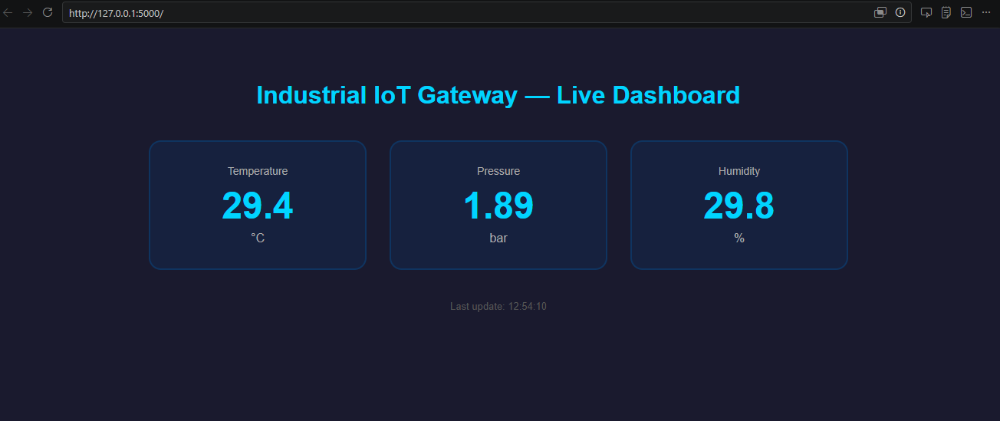
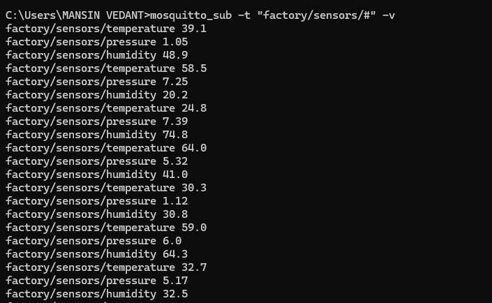

# Industrial IoT Gateway & Live Monitoring System

A complete IIoT pipeline simulating a real factory floor — from PLC sensor data collection 
to live web dashboard monitoring — using Modbus TCP, MQTT, and OPC UA protocols.

---

## Tech Stack
Python · Modbus TCP · MQTT · OPC UA · Flask · SocketIO · pymodbus · paho-mqtt · pandas · Mosquitto

---

## What It Does
- Simulates a PLC generating live sensor data (temperature, pressure, humidity) via Modbus TCP
- Gateway reads Modbus data and translates it to MQTT for cloud and OPC UA for SCADA systems
- Live web dashboard displays real time readings with automatic red alerts on threshold breach
- Logs every reading to a CSV file with timestamps for historical analysis

---

## How to Run

**Install dependencies:**
```bash
pip install pymodbus paho-mqtt opcua flask flask-socketio pandas cryptography
```

**Open 3 terminals and run in order:**
```bash
# Terminal 1
python simulator.py

# Terminal 2
python gateway.py

# Terminal 3
python dashboard.py
```

**Then open browser at:**
http://localhost:5000

## Dashboard Preview


## MQTT Live Feed
